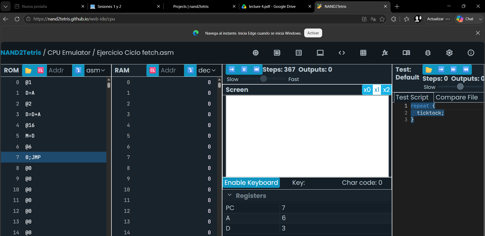
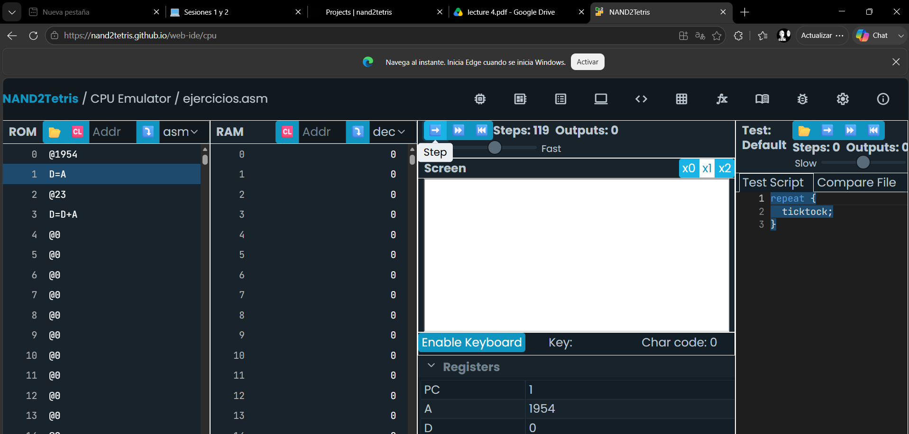
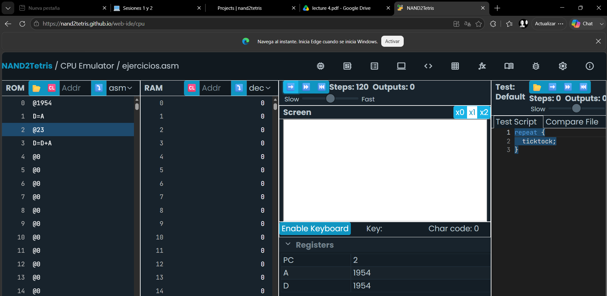
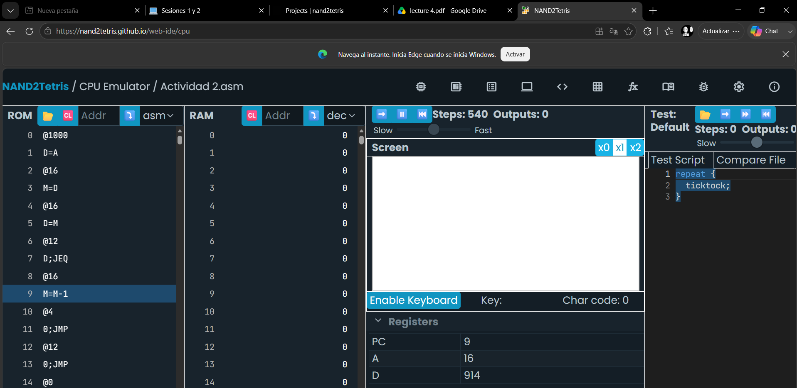
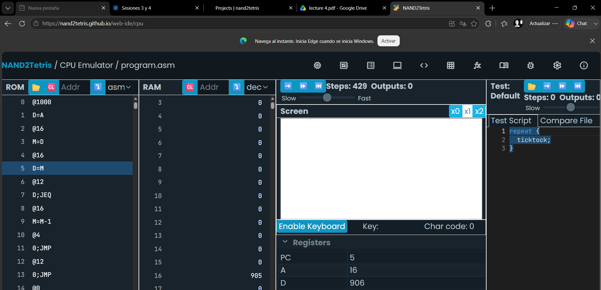

# Unidad 1

## Sesion 1 y 2


### Ciclo Fetch

Ejecuta las instrucciones y suma continuamente el valor D+A repitiendo el procedimiento infinitamente 

```

@1954
D=A 
@23
D=D+A 


			@1
			D=A
			@2
			D=D+A
			@16
			M=D
(END)
			@END
			0;JMP  

```




### Segundo ejercicio

```


@1954
D=A 
@23
D=D+A 

```
### Paso a Paso





## Sesion 3


La actividad muestra como se utiliza el Data Register como un temporizador desde 1000 a 0

```
@1000
D=A 
@i
M=D
(LOOP)
@i
D=M
@CONT
D;JEQ
@i
M=M-1
@LOOP
0;JMP
(CONT)
@CONT
0;JMP
```



## Sesion 4


```
@SCREEN
D=A
@i
M=D

(READKEYBOARD)
@KBD
D=M
@KEYPRESSED
D;JNE
@i
D=M
@SCREEN
D=D-A
@READKEYBOARD
D;JLE
@i
M=M-1
A=M
M=0
@READKEYBOARD
0;JMP

(KEYPRESSED)
@i
D=M
@KBD
D=D-A
@READKEYBOARD
D;JGE
@i
A=M
M=-1
@i
M=M+1
@READKEYBOARD
0;JMPS
```


## marcelo villegas - 000428106